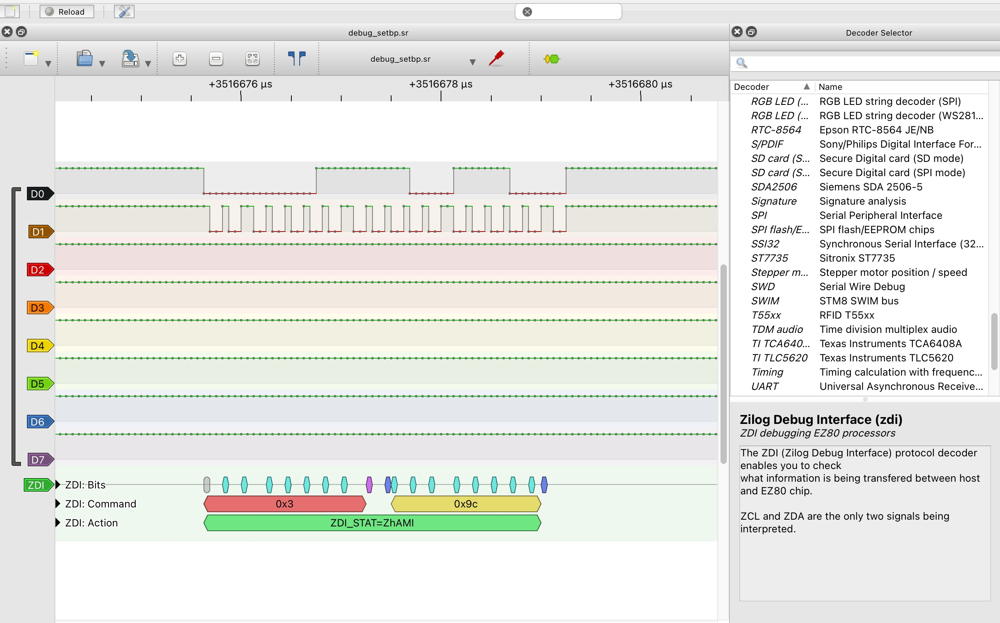

# ZDI protocol analyser
This is the Zilog Debug Interface protocol analyser for sigrok and PulseView.

## Installation
Copy the zdi folder over to your 'decoders' folder.

## Usage with sigrok-cli
Below a couple of examples of using it with the command-line client.

Normal usage:
```
sigrok-cli -i captures/debug_setbp.sr -P zdi -A zdi
```

Non-standard decoder folder:
```
SIGROKDECODE_DIR=/mydecoderdir/ZDI sigrok-cli -i captures/debug_setbp.sr -P zdi -A zdi
```
## Usage with Pulseview
After installing the ZDI decoder in the right folder you can find it in the decoder selector.
